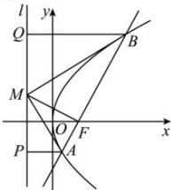

> [!faq]- 全练一本通解析
> **【解析】**
> 1
> 解析:如图所示:
> 
> 因为 $MF \perp AB$ ，所以 MA 为 $\triangle MAF$ 外接圆的直径，MB 为 $\triangle MBF$ 外接圆的直径，
> 所以 $AP \perp l, BQ \perp l$ 由抛物线的定义得 AP = AF, BQ = BF，
> 则 $\angle BMQ = \angle BMF, \angle AMP = \angle AMF$ 所以 $\angle BMQ = \angle BMF, \angle AMP = \angle MBQ$ 所以 $Rt\triangle AMP \sim Rt\triangle MBQ$ 则 $\frac{|MP|}{|BQ|} = \frac{|AP|}{|MQ|}$ 所以 $\frac{|MP|\cdot|MQ|}{|AF|\cdot|BF|} = \frac{|MP|}{|AP|}\cdot\frac{|MQ|}{|BQ|} = \frac{|MP|}{|BQ|}\cdot\frac{|MQ|}{|AP|} = 1$ ，故答案为：1
