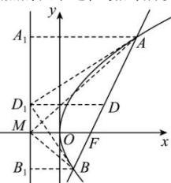

> [!faq]- 全练一本通解析
> **【答案】** BCD
>
> **【解析】**
> 解析: 对 A, 抛物线 $C: y^{2} = 4x$ 的焦点坐标为 $(1,0)$ , 准线方程为 x = -1, 过焦点的弦中通径最短, 所以 AB 最小值 2p = 4, 故 A 不正确;
> 
> 对B,如图,设线段AB的中点为D,过点A,B,D作准线的垂线,垂足分别为 $A_{1}$ , $B_{1}$ , $D_{1}$ ，由抛物线的定义可知 $\left|AA_{1}\right|=\left|AF\right|,\left|BB_{1}\right|=\left|BF\right|$ ，
> 所以 $\left|DD_{1}\right|=\frac{1}{2}\left(\left|AA_{1}\right|+\left|BB_{1}\right|\right)=\frac{1}{2}\left|AB\right|$ 所以以线段AB为直径的圆与直线x=-1相切，故B正确；
> 对C,设AB所在的方程为 $x=ny+1$ ,
> 由 $\left\{\begin{aligned}x&=ny+1,\\ y^{2}&=4x\end{aligned}\right.$ 消去x得 $y^{2}-4ny-4=0$ ,
> 所以 $y_{1}y_{2}=-4$ , $x_{1}x_{2}=\frac{(y_{1}y_{2})^{2}}{16}=1$ ，故C正确；
> 对D,由C得 $y_{1}+y_{2}=4n$ , $k_{AM}+k_{BM}=\frac{y_{1}}{x_{1}+1}+\frac{y_{2}}{x_{2}+1}=\frac{2ny_{1}y_{2}+2(y_{1}+y_{2})}{(x_{1}+1)(x_{2}+1)}=\frac{-8n+8n}{(x_{1}+1)(x_{2}+1)}=0$ ，故D正确.
>
> 故选 **BCD**
