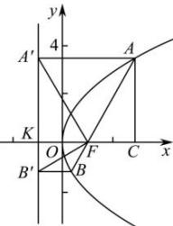

> [!faq]- 全练一本通解析
> **【答案】** ABC
>
> **【解析】**
> 解析:对于选项A,设直线AB的方程为 $x=my+\frac{p}{2}$ ，代入 $y^{2}=2px$ ,
> 可得 $y^{2}-2pmy-p^{2}=0$ ，所以 $y_{1}\cdot y_{2}=-p^{2}$ ， $x_{1}\cdot x_{2}=\frac{y_{1}^{2}\cdot y_{2}^{2}}{2p}=\frac{p^{2}}{4}$ ，选项A正确；
> 对于选项B,因为AB是过抛物线 $y^{2}=2px$ 的焦点的弦，
> 所以由抛物线定义可得 $\left|AB\right|=\left|AF\right|+\left|BF\right|=x_{1}+\frac{p}{2}+x_{2}+\frac{p}{2}=x_{1}+x_{2}+p$ ,
> 由选项A知， $y_{1}\cdot y_{2}=-p^{2}$ ， $y_{1}+y_{2}=2pm$ 所以 $y_{1}^{2}+y_{2}^{2}=(y_{1}+y_{2})^{2}-2y_{1}\cdot y_{2}=4p^{2}m^{2}+2p^{2}$ .
> 即 $y_{1}^{2}+y_{2}^{2}=2p(x_{1}+x_{2})=4p^{2}m^{2}+2p^{2}$ ，解得 $x_{1}+x_{2}=2pm^{2}+p$ 当 $\theta=90^{\circ}$ 时，m=0，所以 $|AB|=2p$ 当 $\theta\neq90^{\circ}$ 时， $m=\frac{1}{\tan\theta}$ ，所以 $\left|AB\right|=\frac{2p}{\tan^{2}\theta}+2p=2p\left(\frac{1}{\tan^{2}\theta}+1\right)=2p\left(\frac{\cos^{2}\theta}{\sin^{2}\theta}+1\right)=\frac{2p}{\sin^{2}\theta}$ 当 $\theta=90^{\circ}$ 时， $\sin\theta=1$ 也适合上式，所以 $\left|AB\right|=x_{1}+x_{2}+p=\frac{2p}{\sin^{2}\theta}$ ，选项B正确；
> 对于选项 C, 不妨设 $\theta\in\left(0,\frac{\pi}{2}\right)$ ，点 A 在 x 轴上方，设 $A'$ ， $B'$ 是 A，B 在准线上的射影， $\left|AF\right|=\left|AA'\right|=\left|CK\right|=p+\left|CF\right|=p+\left|AF\right|\cos\theta$ 所以 $\left|AF\right|=\frac{p}{1-\cos\theta}$ ，同理可得 $\left|BF\right|=\frac{p}{1+\cos\theta}$ 所以 $\frac{1}{\left|AF\right|} + \frac{1}{\left|BF\right|} = \frac{2}{p}$ ，同理可证 $\theta \in [\frac{\pi}{2}, \pi)$ 时，等式也成立，选项 C 正确；
> 对于选项 D, 由上可知： $y_{1}\cdot y_{2}=-p^{2}$ , $x_{1}\cdot x_{2}=\frac{y_{1}^{2}\cdot y_{2}^{2}}{2p}=\frac{p^{2}}{4}$ ,
> 所以 $y_{1}y_{2}=-4x_{1}x_{2}$ ，选项 D 不正确，
> 故选:ABC.
> 
