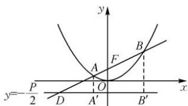

> [!faq]- 全练一本通解析
> **【答案】** ACB
>
> **【解析】**
> 解析:抛物线 $x^{2}=2py$ 的焦点坐标为 $F(0,\frac{P}{2})$ ，准线方程是 $y=-\frac{p}{2}$ ，由题意知，直线 l 的斜率一定存在，
> 设其方程为 $y=kx+\frac{p}{2}$ ，联立 $\left\{\begin{aligned}x^{2}&=2py,\\ y&=kx+\frac{p}{2},\end{aligned}\right.$ 消去 y 得 $x^{2}-2pkx-p^{2}=0$ 设线段 AB 的中点 $M(x_{0},y_{0})$ 所以 $x_{0}=\frac{x_{1}+x_{2}}{2},y_{0}=\frac{y_{1}+y_{2}}{2}$
> 所以点 M 到准线 $y = -\frac{p}{2}$ 的距离 $d = y_{0} + \frac{p}{2} = \frac{y_{1} + y_{2} + p}{2} = \frac{|AB|}{2}$ ，
> 所以以 AB 为直径的圆与抛物线 C 的准线相切，故 A 正确；
> 由韦达定理, 得 $x_{1}x_{2}=-p^{2}, y_{1}y_{2}=\frac{x_{1}^{2}}{2p}\times\frac{x_{2}^{2}}{2p}=\frac{p^{2}}{4}$ ，故 B 错误； $y_{1}+y_{2}=k(x_{1}+x_{2})+p=2pk^{2}+p$ 所以 $\frac{1}{|AF|}+\frac{1}{|BF|}=\frac{1}{y_{1}+\frac{p}{2}}+\frac{1}{y_{2}+\frac{p}{2}}=\frac{y_{1}+y_{2}+p}{y_{1}y_{2}+\frac{p}{2}(y_{1}+y_{2})+\frac{p^{2}}{4}}=\frac{2pk^{2}+2p}{\frac{p^{2}}{4}+\frac{p}{2}(2pk^{2}+p)+\frac{p^{2}}{4}}=\frac{2p(k^{2}+1)}{p^{2}(k^{2}+1)}=\frac{2}{p}$ ，故 C 正确；
> 若直线 l 的倾斜角为 $\frac{\pi}{6}$ ，且 $x_{1}<x_{2}$ ，则点 A 在点 B 左侧，
> 如图, 直线 l 与准线交于点 D, $|AA'|, |BB'|$ 分别表示点 A, B 到准线 $y=-\frac{p}{2}$ 的距离,
> 
> 则 $\sin\angle ADA'=\frac{|AA'|}{|AD|}=\frac{1}{2}$ ，设 $|AF|=t$ ，则 $\left|AA'\right|=t,|AD|=2t$ ，
> 又 $\sin\angle BDB'=\frac{\left|BB'\right|}{\left|BD\right|}=\frac{\left|BB'\right|}{\left|AD\right|+\left|AF\right|+\left|BF\right|}=\frac{\left|BF\right|}{2t+t+\left|BF\right|}=\frac{1}{2}$ 所以 $|BF|=3t$ ，所以 $\frac{|AF|}{|BF|}=\frac{t}{3t}=\frac{1}{3}$ ，故 D 正确.
>
> 故选 **ACD**.
