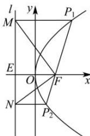

> [!faq]- 全练一本通解析
> **【答案】** BCD
>
> **【解析】**
> 解析:设准线l:x=- $\frac{p}{2}$ 与x轴的交点为E,连接MF,NF,如图
> 
> 由抛物线的定义可得， $\left|MP_{1}\right|=\left|FP_{1}\right|,\left|NP_{2}\right|=\left|FP_{2}\right|$ ，由题意可得， $\angle FP_{1}M=\theta,\angle FP_{2}N=\pi-\theta,\angle EFM=\frac{\pi-\theta}{2},\angle EFN=\frac{\theta}{2},\left|EF\right|=p$ ，在Rt△EFM中， $\left|MF\right|=\frac{p}{\cos\frac{\pi-\theta}{2}}=\frac{p}{\sin\frac{\theta}{2}}$ ，在△ $P_{1}MF$ 中， $\left|P_{1}F\right|=\frac{\left|\frac{MF}{2}\right|}{\sin\frac{\theta}{2}}=\frac{p}{2\sin^{2}\frac{\theta}{2}}=\frac{p}{1-\cos\theta}$ ，同理可得
> $\left|NF\right|=\frac{p}{\cos\frac{\theta}{2}}$ , $\left|P_{2}F\right|=\frac{p}{1+\cos\theta}$ ，所以 $\frac{1}{\left|P_{1}F\right|}+\frac{1}{\left|P_{2}F\right|}=\frac{2}{p}$ ，故 A 错误，B, D 正确；在 $\triangle MNF$ 中， $\angle MFN=\angle EFM+\angle EFN=\frac{\pi}{2}$ ，所以 $\left|MN\right|=\sqrt{\left|MF\right|^{2}+\left|NF\right|^{2}}=\frac{2p}{\sin\theta}$ ，所以 $S_{\triangle MON}=\frac{1}{2}\left|MN\right|\cdot\left|OE\right|=\frac{1}{2}\cdot\frac{2p}{\sin\theta}\cdot\frac{p}{2}=\frac{p^{2}}{2\sin\theta}$ ，故 D 正确。
>
> 故选 **BCD**
