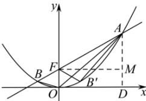

> [!faq]- 全练一本通解析
> **【答案】** ACD
>
> **【解析】**
> 解析: 抛物线 $C: x^{2}=2py(p>0)$ 的焦点为 $F(0,\frac{p}{2})$ ，准线方程为 $y=-\frac{p}{2}$ ，设 $A(x_{1},y_{1}), B(x_{2},y_{2}), x_{1}>0$ ，过 A 作 $AD \perp x$ 轴于 D，过 F 作 $FM \perp AD$ 于 M，显然 $\angle AFM = \theta$ ，由抛物线定义得 $|FA|=y_{1}+\frac{p}{2}$ ， $|AM|=|AD|-|OF|=y_{1}-\frac{p}{2}=|FA|-p$ ，而 $|AM|=|FA|\sin\theta$ ，则 $|FA|\sin\theta=|FA|-p$ ，因此 $|FA|\sin\theta+p=|FA|$ ，A 正确；
> 显然 $FA=\frac{p}{1-\sin\theta}$ ，同理 $|FB|=\frac{p}{1+\sin\theta}$ ，则 $|AB|=|FB|+|FA|=\frac{p}{1+\sin\theta}+\frac{p}{1-\sin\theta}=\frac{2p}{\cos^{2}\theta}$ ，B 错误；
> 又 $\angle OFB = \frac{\pi}{2} - \theta$ ，则点 O 到直线 AB 的距离 $d=|OF|\sin(\frac{\pi}{2}-\theta)=\frac{p}{2}\cos\theta$ 因此 $S_{\triangle AOB}=\frac{1}{2}|AB|\cdot d=\frac{1}{2}\cdot\frac{2p}{\cos^{2}\theta}\cdot\frac{p}{2}\cos\theta=\frac{p^{2}}{2\cos\theta}$ ，C 正确；
> 显然 $\angle OFB' = \angle OFB = \frac{\pi}{2} - \theta$ ，则 $\angle AFB' = 2\theta$ ，又 $|FB'| = |FB| = \frac{p}{1 + \sin\theta}$ ，因此 $S_{\triangle AFB'} = \frac{1}{2}|FA||FB'| \sin 2\theta = \frac{1}{2}\cdot\frac{p}{1 - \sin\theta}\cdot\frac{p}{1 + \sin\theta}\cdot \sin 2\theta = p^{2} \tan\theta$ ，D 正确。故选：ACD
> 
