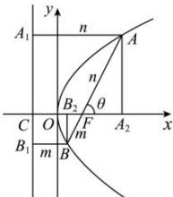

> [!faq]- 全练一本通解析
> **【答案】** BC
>
> **【解析】**
> 解析: 对于 A 项, 过点 $A, B$ 分别作准线 $x = -\frac{1}{2}$ 的垂线, 垂足分别为 $A_1, B_1$ ,
> 过点 $A, B$ 分别作 $x$ 轴的垂线, 垂足分别为 $A_2, B_2$ , 准线与 $x$ 轴的交点为 $C$ ,
> 设直线 $AB$ 的倾斜角为 $\theta$ . 画图为:
> 
> 根据抛物线的定义： $\left|AA_{1}\right|=\left|AF\right|=n$ ，从图可知 $\left|AA_{1}\right|=\left|A_{2}C\right|=n,\left|CF\right|=p=1,$ $\left|CF\right|+\left|FA_{2}\right|=\left|AA_{1}\right|=n$ ，在 $Rt_{\triangle AFA_{2}}$ 中， $\left|FA_{2}\right|=n\cos\theta$ ，
> 所以 $n\cos\theta+1=n,\therefore n=\frac{1}{1-\cos\theta}$ ，同理 $m=\frac{1}{1+\cos\theta}$ ，
> 则 $\left|AB\right|=\left|AF\right|+\left|BF\right|=\frac{1}{1-\cos\theta}+\frac{1}{1+\cos\theta}=\frac{2}{\sin^{2}\theta}$ $\because\theta\in[0,\pi)\therefore\sin\theta\in[0,1]$ ，故当 $\sin\theta=1$ 时 $\left(\frac{2}{\sin^{2}\theta}\right)_{\min}=2$ ，
> 故 $\left|AB\right|$ 最小值为 2，此时 AB 垂直于 x 轴，所以 A 不正确；
> 对于 B 项，由 A 可知， $\left|AB\right|=\frac{2}{\left(\frac{\sqrt{3}}{2}\right)^{2}}=\frac{8}{3}$ ，故 B 正确；
> 对于 C 项， $\left|AB\right|\leq\left|AF\right|+\left|BF\right|=x_{A}+x_{B}+1=2\times2+1=5$ ，
> 当且仅当直线 AB 过焦点 F 时等号成立，所以 $\left|AB\right|$ 最大值为 5，故 C 正确；
> 当直线 AB 过焦点 F 时， $\frac{1}{\left|AF\right|}+\frac{1}{\left|BF\right|}=1-\cos\theta+1+\cos\theta=2$ ，
> 当直线 AB 不过焦点 F 时， $\frac{1}{\left|AF\right|}+\frac{1}{\left|BF\right|}$ 不是定值，
> 举例当 $x_{A}=x_{B}=2$ 时，此时 $y_{A}=2,y_{B}=-2$ ，
> 即 $A(2,2),B(2,-2),F(\frac{1}{2},0),AF=BF=\sqrt{\left(\frac{3}{2}\right)^{2}+2^{2}}=\frac{5}{2}$ ， $\frac{1}{\left|AF\right|}+\frac{1}{\left|BF\right|}=\frac{2}{5}\times2=\frac{4}{5}\neq2$ ，故 D 错误；
>
> 故选 **BC**.
