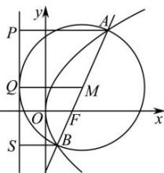

> [!faq]- 全练一本通解析
> **【答案】** ABD
>
> **【解析】**
> 解析：
> 
> 如图, 设直线 AB 为 $x = my + \frac{p}{2}$ ,
> 联立 $y^{2}=2px$ 得 $y^{2}=2p\left(my+\frac{p}{2}\right)$ ，即 $y^{2}-2pmy-p^{2}=0$ 所以 $y_{1}+y_{2}=2pm$ ， $y_{1}y_{2}=-p^{2}$ 故 D 正确， $\left|AB\right|=x_{1}+x_{2}+p=my_{1}+\frac{p}{2}+my_{2}+\frac{p}{2}+p=m(y_{1}+y_{2})+2p$ 将 $y_{1}+y_{2}=2pm$ 代入得 $\left|AB\right|=2m^{2}p+2p$ 故当 m=0 时， $\left|AB\right|$ 取得最小值 2p，此时直线 AB 与 x 轴垂直，故 A 正确， $\frac{1}{\left|AF\right|}+\frac{1}{\left|BF\right|}=\frac{1}{x_{1}+\frac{p}{2}}+\frac{1}{x_{2}+\frac{p}{2}}$ $=\frac{1}{my_{1}+p}+\frac{1}{my_{2}+p}=\frac{m(y_{1}+y_{2})+2p}{m^{2}y_{1}y_{2}+mp(y_{1}+y_{2})+p^{2}}$ 代入 $y_{1}+y_{2}=2pm$ ， $y_{1}y_{2}=-p^{2}$ 得 $\frac{1}{\left|AF\right|}+\frac{1}{\left|BF\right|}=\frac{2m^{2}p+2p}{m^{2}p^{2}+p^{2}}=\frac{2}{p}$ ，故 B 正确，
> 设 AB 的中点为 M，则以弦 AB 为直径的圆的圆心为 M，半径为 $\frac{\left|AB\right|}{2}$ 分别过 A, B, M 作抛物线的垂线，垂足分别为 P, Q, S，
> 由抛物线的定义知 $\left|AP\right|=\left|AF\right|,\left|BF\right|=\left|BS\right|$ 则 $\left|MQ\right|=\frac{1}{2}\left(\left|AP\right|+\left|BS\right|\right)=\frac{1}{2}\left(\left|AF\right|+\left|BF\right|\right)=\frac{1}{2}\left|AB\right|$ 故以弦 AB 为直径的圆与直线 $x=-\frac{p}{2}$ 相切，C 错误，
>
> 故选 **ABD**
