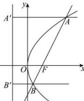

> [!faq]- 全练一本通解析
> **【答案】** BC
>
> **【解析】**
> 解析: 法一: 如图, $F\left(\frac{p}{2},0\right)$ , 直线的斜率为 $\sqrt{3}$ , 则设直线 l 的方程为 $y=\sqrt{3}\left(x-\frac{p}{2}\right)$ ,
> 
> 联立 $\left\{ \begin{array}{l} y^{2} = 2px \\ y = \sqrt{3}\left(x - \frac{p}{2}\right) \end{array} \right.$ 得 $12x^{2} - 20px + 3p^{2} = 0$ ，解得： $x_{A} = \frac{3p}{2}, x_{B} = \frac{p}{6}$ . 由 $\left|AF\right| = x_{A} + \frac{p}{2} = 2p = 8$ ，得 $p = 4$ ，故 A 错误；由于 $\left|BF\right| = x_{B} + \frac{p}{2} = \frac{2}{3} p$ ，则 $\left|AF\right| = 3\left|BF\right|$ ，故 B 正确；同理 $\frac{1}{\left|AF\right|} + \frac{1}{\left|BF\right|} = \frac{3}{8} + \frac{1}{8} = \frac{1}{2}$ ，故 C 正确；因为直线 $l$ 的方程为 $y = \sqrt{3}(x - 2)$ ，原点到直线的距离为 $d = \frac{2\sqrt{3}}{\sqrt{3 + 1}} = \sqrt{3}$ ，所以 $S_{\triangle AOB} = \frac{1}{2} \times \sqrt{3} \times \left(8 + \frac{8}{3}\right) = \frac{16\sqrt{3}}{3}$ ，故 D 错误。法二：由倾角式焦半径公式和面积公式可知， $\left|AF\right| = \frac{p}{1 - \cos\alpha} = 2p = 8, p = 4$ ，其中 $\alpha = \frac{\pi}{3}$ ，故 A 错误；
> 答案为:BC
> $\left|BF\right| = \frac{p}{1 + \cos\alpha} = \frac{2}{3} p = \frac{8}{3}$ 故B、C正确； $S_{\triangle AOB} = \frac{p^2}{2\sin\alpha} = \frac{16}{2\sin\alpha} = \frac{16\sqrt{3}}{3}$ 故D错误.
