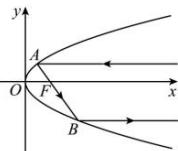

<!-- question-source:start -->
【2】（2024·高二上浙江宁波期末）如图,某种探照灯的轴截面是抛物线 $y^{2}=x$ （焦点 F），平行于对称轴的一光线，经射入点 A 反射过 F 到点 B，再经反射，平行于对称轴射出光线，则入射点 A 到反射点 B 的光线距离 $\left|AB\right|$ 最短时点 A 的坐标是（）

A. $\left(\frac{1}{4},\frac{1}{2}\right)$ B. $\left(\frac{1}{2},\frac{\sqrt{2}}{2}\right)$ C. (1,1) D. $(2,\sqrt{2})$
<!-- question-source:end -->
