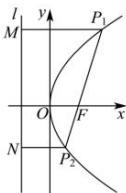

<!-- question-source:start -->
【32】（多选）已知倾斜角为 $\theta$ 的直线经过抛物线 $y^{2}=2px\ (p>0)$ 的焦点 F，且与抛物线交于 $P_{1}$ ， $P_{2}$ 两点，已知直线 $l:x=-\frac{p}{2}$ ，作 $P_{1}M\perp l$ 于点 M， $P_{2}N\perp l$ 于点 N，则下列结论正确的有（）

A. $\frac{1}{|P_1F|} +\frac{1}{|P_2F|} = \frac{1}{p}$ B. $|P_{1}F| = \frac{p}{1 - \cos\theta}$ C. $|P_2F| = \frac{p}{1 + \cos\theta}$ D. $S_{\triangle MON} = \frac{p^2}{2\sin\theta}$
<!-- question-source:end -->
