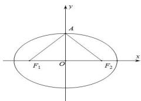

> [!faq]- 全练一本通解析
> **【答案】** $\frac{x^{2}}{4}+y^{2}=1$
>
> **【解析】**
> 如图根据椭圆的性质可知,当点 A 为椭圆与 y 轴的交点时, $\angle F_{1}AF_{2}$ 最大.根据椭圆图形的对称性,可得 $\angle OAF_{2}=60^{\circ}$ .
> 根据椭圆方程 $c^{2}=a^{2}-\left(a^{2}-3\right)=3$ ，故 $OF_{2}=\sqrt{3}$ ，在直角三角形 $OAF_{2}$ 中，因为 $\angle OAF_{2}=60^{\circ}$ ，可得 $AF_{2}=2$ 故 a=2，所以该椭圆的标准方程为 $\frac{x^{2}}{4} + y^{2} = 1$
> 
