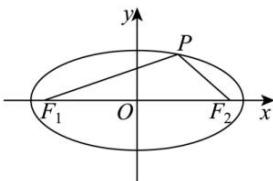

> [!faq]- 全练一本通解析
> **【答案】** $120^{\circ}$
>
> **【解析】**
> 在椭圆 $\frac{x^{2}}{9} + \frac{y^{2}}{2} = 1$ 中, a = 3, $b = \sqrt{2}$ , 则 $c=\sqrt{a^{2}-b^{2}}=\sqrt{9-2}=\sqrt{7}$
> 
> 由椭圆的定义可得 $\left|PF_{2}\right|=2a-\left|PF_{1}\right|=6-4=2$
> 在 $\triangle PF_{1}F_{2}$ 中，由余弦定理可得
> $$
> \cos \angle F _ {1} P F _ {2} = \frac {\left| P F _ {1} \right| ^ {2} + \left| P F _ {2} \right| ^ {2} - \left| F _ {1} F _ {2} \right|}{2 \left| P F _ {1} \right| \cdot \left| P F _ {2} \right|} = \frac {1 6 + 4 - 2 8}{2 \times 4 \times 2} = - \frac {1}{2},
> $$
> 又因为 $0^{\circ} \leq \angle F_{1}PF_{2} \leq 180^{\circ}$ , 所以, $\angle F_{1}PF_{2} = 120^{\circ}$ . 故答案为: $120^{\circ}$ .
