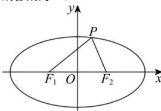

> [!faq]- 全练一本通解析
> **【答案】** 40
>
> **【解析】**
> 由题意可得 $a^{2}=12, b^{2}=3, c^{2}=9$
> $$
> \triangle P F _ {1} F _ {2} \text {中，} \angle F _ {1} P F _ {2} = 6 0 ^ {\circ}
> $$
> $$
> \cos \angle F _ {1} P F _ {2} = \frac {\left| P F _ {1} \right| ^ {2} + \left| P F _ {2} \right| ^ {2} - \left| F _ {1} F _ {2} \right| ^ {2}}{2 \left| P F _ {1} \right| \left| P F _ {2} \right|} = \frac {1}{2}
> $$
> 得 $\left(\left|PF_1\right| + \left|PF_2\right|\right)^2 -\left|F_1F_2\right|^2 = 3\left|PF_1\right|\left|PF_2\right|$
> 得 $(2a^{2}) - (2c)^{2} = 3\mid PF_{1}\parallel PF_{2}\mid$
> 所以
> $\left|PF_{1}\right|\left|PF_{2}\right|=\frac{4}{3}b^{2}=4.\left|PF_{1}\right|^{2}+\left|PF_{2}\right|^{2}=\left|F_{1}F_{2}\right|^{2}+\left|PF_{1}\right|\left|PF_{2}\right|=4c^{2}+\frac{4}{3}b^{2}=40$ 故答案为:40.
> 
