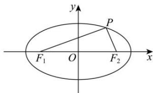

> [!faq]- 全练一本通解析
> **【解析】**
> 4√3
> 解析: ∵ 椭圆 $C:\frac{x^{2}}{20}+\frac{y^{2}}{4}=1$ 得 $a=2\sqrt{5}$ , b=2, c=4,
> 设 $\left|PF_{1}\right|=m,\left|PF_{2}\right|=n$ ，则 $m+n=4\sqrt{5}$ ∵ $PF_{1} \perp PF_{2}$ , ∴ $m^{2} + n^{2} = 64$ ,
> ∴ $2mn = (m + n)^{2} - (m^{2} + n^{2}) = 16$ , ∴ $(m - n)^{2} = (m + n)^{2} - 4mn = 80 - 32 = 48$ ,
> ∴ $|m-n|=4\sqrt{3}$ ，即 $\|PF_{1}-|PF_{2}\|=4\sqrt{3}$ .
> 故答案为： $4\sqrt{3}$
> 
