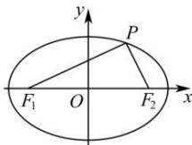

> [!faq]- 全练一本通解析
> **【答案】** A
>
> **【解析】**
> 解析:由椭圆的方程 $\frac{x^{2}}{9}+\frac{y^{2}}{4}=1$ 可得 a=3, b=2，所以 $c=\sqrt{a^{2}-b^{2}}=\sqrt{9-4}=\sqrt{5}$ 设 $\left|PF_{1}\right|=r$ ，则 $\left|PF_{2}\right|=2a-r=6-r$ ，由 P 在第一象限可得 r>6-r，即 r>3，
> 因为 $PF_{1} \perp PF_{2}$ ，所以 $r^{2} + (6 - r)^{2} = (2c)^{2} = 20$ ，
> 整理可得 $r^{2}-6r+8=0$ ，
> 解得 r=4 或 2（舍），
> 即 $\left|PF_{1}\right|=4,\left|PF_{2}\right|=2$ 所以在 Rt△ $PF_{1}F_{2}$ 中， $\tan\angle PF_{1}F_{2}=\frac{\left|PF_{2}\right|}{\left|PF_{1}\right|}=\frac{2}{4}=\frac{1}{2}$ ，故选：A.
> 
