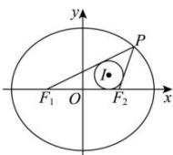

> [!faq]- 全练一本通解析
> **【答案】** B
>
> **【解析】**
> 解析:依题意,设椭圆 C 的方程为 $\frac{x^{2}}{a^{2}} + \frac{y^{2}}{b^{2}} = 1 (a > b > 0)$ ，由 $P(4,3)$ 在 C 上，得 $\frac{16}{a^{2}} + \frac{9}{b^{2}} = 1$ ，
> 显然 $\triangle PF_{1}F_{2}$ 的内切圆与直线 $F_{1}F_{2}$ 相切，则该圆半径为1，而
> $$
> S _ {\triangle P F _ {1} F _ {2}} = \frac {1}{2} (2 a + 2 c) \cdot 1 = a + c
> $$
> 又 $S_{\triangle PF_1F_2} = \frac{1}{2}\cdot 2c\cdot 3 = 3c$ ，于是 $a = 2c$ ， $b^{2} = a^{2} - c^{2} = \frac{3}{4} a^{2}$ ，因此 $\frac{16}{a^2} +\frac{12}{a^2} = 1,$ 解得 $a^2 = 28,b^2 = 21$ ，所以椭圆 $C$ 的标准方程是 $\frac{x^2}{28} +\frac{y^2}{21} = 1.$ 故选：B
> 
