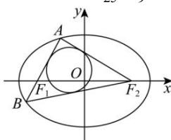

> [!faq]- 全练一本通解析
> **【解析】**
> $\frac{5}{2}$
> 解析:由椭圆 $C:\frac{x^{2}}{25}+\frac{y^{2}}{9}=1$ ，可知长轴长 2a=10，焦距为 2c=8，
> 
> 因为 $\triangle ABF_{2}$ 内切圆的面积为 $\pi$ ，
> 所以 $\triangle ABF_{2}$ 内切圆的半径为 1，
> $$
> \triangle A B F _ {2}
> $$
> $$
> r, \triangle A B F _ {2}
> $$
> $$
> m = 4 a = 2 0
> $$
> $$
> S _ {\triangle A B F _ {2}} = \frac {1}{2} m r
> $$
> 又因为 $S_{\triangle ABF_2} = S_{\triangle AF_1F_2} + S_{\triangle BF_1F_2} = \frac{1}{2}|F_1F_2|\cdot |y_1 - y_2|$ 所以 $\frac{1}{2} mr = \frac{1}{2}|F_1F_2|\cdot |y_1 - y_2|$ ，即 $20\times 1 = 8|y_{1} - y_{2}|$ ，所以 $\left|y_1 - y_2\right| = \frac{5}{2}$
