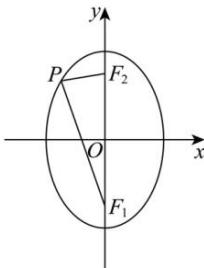

> [!faq]- 全练一本通解析
> **【解析】**
> $\frac{\sqrt{35}}{3}$ 解析：由椭圆可得 $a^2 = 16$ ， $b^{2} = 7$ ， $c^2 = 9$ ，所以 $\left|PF_1\right| + \left|PF_2\right| = 2a = 8$ ， $\left|F_1F_2\right| = 2c = 6$ 所以 $\left|PF_1\right| = \left|F_1F_2\right| = 6$ ，故 $\left|PF_2\right| = 2$ .
> 在 $\triangle PF_1F_2$ 中， $\cos \angle F_1PF_2 = \frac{\left|PF_1\right|^2 + \left|PF_2\right|^2 - \left|F_1F_2\right|^2}{2\left|PF_1\right||PF_2|} = \frac{1}{6},$ 因为 $\cos^2\angle F_1PF_2 + \sin^2\angle F_1PF_2 = 1$ ，且 $\sin \angle F_1PF_2 > 0$ ，所以 $\sin \angle F_1PF_2 = \frac{\sqrt{35}}{6},$ 设 $P$ 的坐标为 $(x_0,y_0)$ ，且 $S_{\triangle F_1PF_2} = \frac{1}{2}\big|F_1F_2\big|\cdot |x_0| = \frac{1}{2}\big|PF_2\big|\cdot |F_1P|\sin \angle F_1PF_2,$ 所以 $\left|x_0\right| = \frac{\sqrt{35}}{3}$ ，所以点 $P$ 到 $y$ 轴的距离为 $\frac{\sqrt{35}}{3}$
> 
