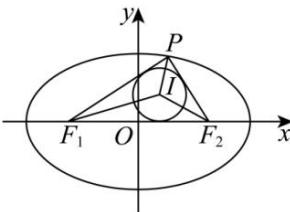

> [!faq]- 全练一本通解析
> **【解析】**
> $\frac{3}{4}$ 解析：由椭圆 $\frac{x^{2}}{9}+\frac{y^{2}}{8}=1$ ，可得 $a=3, b=2\sqrt{2}$ ，则 $c=\sqrt{a^{2}-b^{2}}=1$ ，所以 $\left|F_{1}F_{2}\right|=2$ ，
> 如图所示，不妨设 $P(x_{0},y_{0})(y_{0}>0)$ ，且 $\triangle PF_{1}F_{2}$ 的内切圆半径为 r，
> 可得 $S_{\triangle PF_{1}F_{2}}=\frac{1}{2}\left|F_{1}F_{2}\right|\cdot y_{0}=y_{0},S_{\triangle IPF_{1}}=\frac{1}{2}\left|PF_{1}\right|\cdot r,S_{\triangle IPF_{2}}=\frac{1}{2}\left|PF_{2}\right|\cdot r,S_{\triangle IF_{2}F_{2}}=\frac{1}{2}\left|F_{1}F_{2}\right|\cdot r,$ 又由 $S_{\triangle PF_{1}F_{2}} = S_{\triangle IPF_{1}} + S_{\triangle IPF_{2}} + S_{\triangle IF_{2}F_{2}}$ 可得 $y_{0}=\frac{1}{2}\left(\left|PF_{1}\right|+\left|PF_{2}\right|+\left|F_{1}F_{2}\right|\right)\cdot r=\frac{1}{2}(2a+2c)=4r$ ，即 $y_{0}=4r$ 又由 $S=\triangle PF_{1}F_{2},S_{1}=S_{\triangle IPF_{1}},S_{2}=S_{\triangle IPF_{2}}$
> 所以 $\frac{S_1 + S_2}{S} = \frac{\frac{1}{2}\left(\left|PF_1\right| + \left|PF_2\right|\right) \cdot r}{y_0} = \frac{\frac{1}{2} \cdot 2a \cdot r}{y_0} = \frac{3}{4}$ . 故答案为: $\frac{3}{4}$
> 
