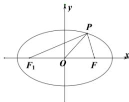

> [!faq]- 全练一本通解析
> **【答案】** A
>
> **【解析】**
> 【详解】设椭圆 $C$ ： $\frac{x^2}{4} +y^2 = 1$ 的左焦点为 $F_{1}$ ，根据题意，作图如下：
> 
> 由 $|OP| = |OF| = \frac{1}{2}\left|F_1F\right|$ ，所以 $PF_{1} \perp PF$ ，
> 所以由焦点三角形面积公式： $S_{\triangle POF} = \frac{1}{2} S_{\triangle PF_1F} = \frac{1}{2} b^2 \tan \frac{\pi}{4} = \frac{1}{2}$
>
> 故选 **A**.
