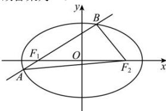

> [!faq]- 全练一本通解析
> **【解析】**
> 20
> 解析:由 $\frac{x^{2}}{25}+\frac{y^{2}}{9}=1$ ，得 $a^{2}=25$ ，得a=5，
> 因为 A,B 两点都在椭圆上，
> 所以由椭圆的定义可得 $\left|AF_{1}\right|+\left|AF_{2}\right|=2a=10,\left|BF_{1}\right|+\left|BF_{2}\right|=2a=10$ 因为 $\left|AB\right|=\left|AF_{1}\right|+\left|BF_{1}\right|$ 所以 $\triangle ABF_{2}$ 的周长为 $\left|AB\right|+\left|AF_{2}\right|+\left|BF_{2}\right|=\left|AF_{1}\right|+\left|BF_{1}\right|+\left|AF_{2}\right|+\left|BF_{2}\right|=4a=20$
> 故答案为:20
> 
