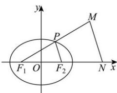

> [!faq]- 全练一本通解析
> **【答案】** 20
>
> **【解析】**
> 椭圆 $\frac{x^{2}}{9}+\frac{y^{2}}{5}=1$ 的长半轴轴 a=3，半焦距 $c=\sqrt{9-5}=2$ ，依题意， $P,F_{2}$ 分别是 $MF_{1},NF_{1}$ 的中点，即 $\left|MF_{1}\right|=2\left|PF_{1}\right|,\left|MN\right|=2\left|PF_{2}\right|,\left|NF_{1}\right|=2\left|F_{2}F_{1}\right|$ 所以 $\triangle MF_{1}N$ 的周长为 $\left|MF_{1}\right|+\left|MN\right|+\left|NF_{1}\right|=2\left(\left|PF_{1}\right|+\left|PF_{2}\right|+\left|F_{2}F_{1}\right|\right)=2(2a+2c)=20$
> 
