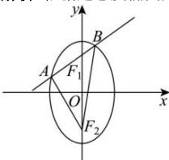

> [!faq]- 全练一本通解析
> **【解析】**
> 6
> 解析:依据题意及椭圆方程,
> 
> 则 $\left|F_{2}A\right|+\left|F_{2}B\right|+\left|AB\right|=4a=16$ ，又 $\left|F_{2}A\right|+\left|F_{2}B\right|=10$ ，所以 $\left|AB\right|=6$ ，故答案为：6.
