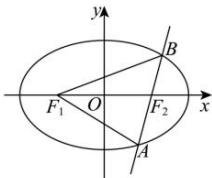

> [!faq]- 全练一本通解析
> **【答案】** $\frac{x^{2}}{3}+\frac{y^{2}}{2}=1$
>
> **【解析】**
> 如图,由 $\triangle AF_{1}B$ 的周长为 $4\sqrt{3}$ 及椭圆的定义可知 $4a=4\sqrt{3}$ , $\therefore a=\sqrt{3}$ .
> 
> $$
> \because 2 c = 2, \therefore c = 1, \therefore b ^ {2} = 2
> $$
> ∴椭圆 C 的方程为 $\frac{x^{2}}{3} + \frac{y^{2}}{2} = 1$ . 故答案为: $\frac{x^{2}}{3} + \frac{y^{2}}{2} = 1$
