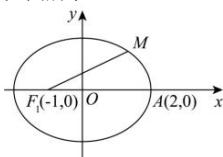

> [!faq]- 全练一本通解析
> **【答案】** 3
>
> **【解析】**
> 因为 $F_1(-1,0)$ 为椭圆 $\frac{x^2}{a^2} + \frac{y^2}{3} = 1(a > 0)$ 的焦点，所以 $a^2 > 3$ ， $c = 1, b = \sqrt{3}$ ，所以由 $a^2 - b^2 = c^2 \Rightarrow a^2 = c^2 + b^2 = 1^2 + (\sqrt{3})^2 = 4$ ，所以椭圆的标准方程为： $\frac{x^2}{4} + \frac{y^2}{3} = 1$ ，如图所示：
> 
> 因为 $F_{1}(-1,0)$ 为椭圆的左焦点，M 为椭圆上的动点，故当 M 处于右顶点 A 时 $\left|MF_{1}\right|$ 最大，
> 且最大值为 $\left|MF_{1}\right|=a+c=2+1=3$ ，故答案为：3.
