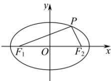

> [!faq]- 全练一本通解析
> **【答案】** D
>
> **【解析】**
> 解析:如图
> 
> 依题意， $PF_{1}\perp PF_{2}$ ， $\angle PF_{2}F_{1}=60^{\circ}$ ， $\left|F_{1}F_{2}\right|=2c$ ，
> 则 $\left|PF_{2}\right|=c,\left|PF_{1}\right|=\sqrt{3}c$ 由椭圆定义可得， $\left|PF_{1}\right|+\left|PF_{2}\right|=\left(\sqrt{3}+1\right)c=2a$ 所以离心率 $e=\frac{c}{a}=\frac{2}{\sqrt{3}+1}=\sqrt{3}-1$ .
>
> 故选 **D**.
