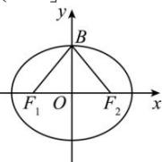

> [!faq]- 全练一本通解析
> **【答案】** 详见解析
>
> **【解析】**
> $\left[0,\frac{\sqrt{3}}{3}\right]$
> 
> 设 $\angle F_{1}BF_{2} = \alpha$ ， $\left|\overline{BF_1}\right| = \left|\overline{BF_2}\right| = a,\left|\overline{F_1F_2}\right| = 2c$ ，由条件知： $a^2\cos \alpha \geq \frac{1}{4}\times 4c^2 = c^2$ ， $\therefore \cos \alpha \geq \frac{c^2}{a^2} = e^2\dots ①$ 在 $\triangle F_{1}BF_{2}$ 中，由余弦定理知： $\cos \alpha = \frac{\left|\overline{BF_1}\right|^2 + \left|\overline{BF_2}\right|^2 - \left|\overline{F_1F_2}\right|^2}{2\left|\overline{BF_1}\right|\cdot\left|\overline{BF_2}\right|} = \frac{2a^2 - 4c^2}{2a^2} = 1 - 2e^2$ ，由①得： $1 - 2e^{2}\geq e^{2},\therefore e^{2}\leq \frac{1}{3},e\leq \frac{\sqrt{3}}{3}$ ；故答案为： $e\in \left(0,\frac{\sqrt{3}}{3}\right]$
