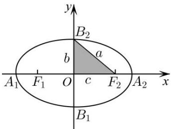
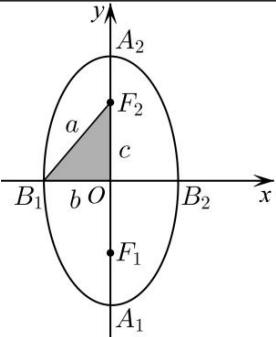

## 1. 椭圆的简单几何性质

<table><tr><td></td><td>焦点在x轴上</td><td>焦点在y轴上</td></tr><tr><td>图形</td><td></td><td></td></tr><tr><td>标准方程</td><td> $\frac{x^2}{a^2}+\frac{y^2}{b^2}=1(a>b>0)$ </td><td> $\frac{y^2}{a^2}+\frac{x^2}{b^2}=1(a>b>0)$ </td></tr><tr><td>焦点</td><td> $F_1(-c,0),F_2(c,0)$ </td><td> $F_1(0,-c),F_2(0,c)$ </td></tr><tr><td>焦距</td><td colspan="2"> $|F_1F_2|=2c$ </td></tr><tr><td>范围</td><td>-a≤x≤a,-b≤y≤b</td><td>-b≤x≤b,-a≤y≤a</td></tr><tr><td>对称性</td><td colspan="2">关于x,y轴、原点对称</td></tr><tr><td>轴长</td><td>长轴长:2a;短轴长:2b</td><td>长轴长:2a;短轴长:2b</td></tr><tr><td>顶点</td><td>(±a,0)(0,±b)</td><td>(0,±a)(±b,0)</td></tr><tr><td rowspan="2">离心率</td><td> $e=\frac{c}{a}=\sqrt{1-\frac{b^2}{a^2}}(0< e< 1)$ </td><td> $e=\frac{c}{a}=\sqrt{1-\frac{b^2}{a^2}}(0< e< 1)$ </td></tr><tr><td colspan="2">离心率越接近1,则椭圆越圆;离心率越接近0,则椭圆越扁</td></tr><tr><td rowspan="2">通径</td><td colspan="2">通径的定义:过焦点且垂直于焦点轴的椭圆的弦长</td></tr><tr><td colspan="2">通径的大小: $\frac{2b^2}{a}$ (最短的焦点弦)</td></tr></table>
