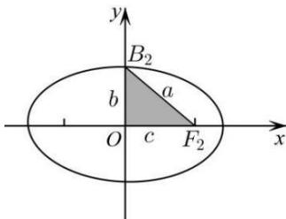

## 2. 椭圆标准方程中的三个量 $a$ 、 $b$ 、 $c$ 的几何意义

椭圆标准方程中, a、b、c 三个量的大小与坐标系无关, 是由椭圆本身的形状大小所确定的, 分别表示椭圆的长半轴长、短半轴长和半焦距长, 均为正数, 且三个量的大小关系为: a > b > 0, a > c > 0, 且 $a^{2} = b^{2} + c^{2}$ .
可借助下图帮助记忆：

a、b、c 恰构成一个直角三角形的三条边, 其中 a 是斜边, b、c 为两条直角边. 由图可知 $e=\frac{c}{a}=\cos\angle OF_{1}B_{1}$ 和 $a, b, c$ 有关的椭圆问题常与与焦点三角形 $\Delta PF_{1}F_{2}$ 有关, 这样的问题考虑到用椭圆的定义及余弦定理 (或勾股定理)、三角形面积公式 $S_{\Delta PF_1F_2} = \frac{1}{2}\left|PF_1\right| \cdot \left|PF_2\right|\sin \angle F_1PF$ 相结合的方法进行计算与解题, 将有关线段 $\left|PF_1\right|$ 、 $\left|PF_2\right|$ 、 $\left|F_1F_2\right|$ , 有关角 $\angle F_{1}PF_{2}$ ( $\angle F_{1}PF_{2} \leq \angle F_{1}BF_{2}$ ) 结合起来, 建立 $\left|PF_1\right| + \left|PF_2\right|$ 、 $\left|PF_1\right| \cdot \left|PF_2\right|$ 之间的关系.
