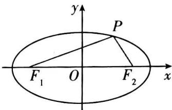

## 4. 椭圆的焦点三角形

定义:椭圆上一点与椭圆的两个焦点组成的三角形通常称为“焦点三角形”.

一般利用椭圆的定义、余弦定理和完全平方公式等知识, 建立 $\left|AF_{1}\right| + \left|AF_{2}\right|$ , $\left|AF_{1}\right|^{2} + \left|AF_{2}\right|^{2}$ , $\left|AF_{1}\right| \cdot \left|AF_{2}\right|$ 之间的关系, 采用整体代入的方法解决焦点三角形的面积、周长及角的有关问题.

性质 1: $\triangle PF_{1}F_{2}$ 的周长为 $\left|PF_{1}\right| + \left|PF_{2}\right| + \left|F_{1}F_{2}\right| = 2a + 2c$ .

性质 2: 当 $\left|PF_{1}\right|=\left|PF_{2}\right|$ 时, $\angle F_{1}PF_{2}$ 最大.

证明： $\left(\left|PF_1\right| + \left|PF_2\right|\right)^2 = (2a)^2$ ， $\left|PF_1\right|^2 +\left|PF_2\right|^2 = 4a^2 -2\left|PF_1\right|\left|PF_2\right|$ ①，

在 $\triangle PF_{1}F_{2}$ 中，由余弦定理得：

$\cos \angle F_{1}PF_{2} = \frac{\left|PF_{1}\right|^{2} + \left|PF_{2}\right|^{2} - \left|FF_{2}\right|^{2}}{2\left|PF_{1}\right|\left|PF_{2}\right|}$ ，把①代入可得，

$$
\cos \angle F _ {1} P F _ {2} = \frac {4 a ^ {2} - 2 \left| P F _ {1} \right| \left| P F _ {2} \right| - 4 c ^ {2}}{2 \left| P F _ {1} \right| \left| P F _ {2} \right|} = \frac {4 \left(a ^ {2} - c ^ {2}\right)}{2 \left| P F _ {1} \right| \left| P F _ {2} \right|} - \frac {2 \left| P F _ {1} \right| \left| P F _ {2} \right|}{2 \left| P F _ {1} \right| \left| P F _ {2} \right|} = \frac {2 b ^ {2}}{\left| P F _ {1} \right| \left| P F _ {2} \right|} 1 (②),
$$

因为 $\left|PF_{1}\right|\left|PF_{2}\right|\leq\frac{\left(\left|PF_{1}\right|+\left|PF_{2}\right|\right)^{2}}{4}=a^{2}$ ，当且仅当 $\left|PF_{1}\right|=\left|PF_{2}\right|=a$ 时等号成立，

所以 $\cos \angle F_{1}PF_{2}\geq \frac{2b^{2}}{a^{2}} -1$ ， $\cos \angle F_1PF_2$ 取最小值时 $\angle F_1PF_2$ 取最大值.

故由以上可得, 当 $\left|PF_{1}\right|=\left|PF_{2}\right|$ 时, $\angle F_{1}PF_{2}$ 最大.

性质 3: $S_{\triangle PF_1F_2} = b^2 \tan \frac{\angle F_1PF_2}{2}$

证明:由②可得, $\left|PF_{1}\right|\left|PF_{2}\right|=\frac{2b^{2}}{1+\cos\angle F_{1}PF_{2}}$ ③.

$S_{\triangle PF_1F_2} = \frac{1}{2}\big|PF_1\big|\big|PF_2\big|\sin \angle F_1PF_2$ ，把③代入面积公式，

$$
S _ {\triangle P F _ {1} F _ {2}} = \frac {b ^ {2}}{1 + \cos \angle F _ {1} P F _ {2}} \cdot \sin \angle F _ {1} P F _ {2} = b ^ {2} \cdot \frac {2 \sin \frac {\angle F _ {1} P F _ {2}}{2} \cos \frac {\angle F _ {1} P F _ {2}}{2}}{2 \cos^ {2} \frac {\angle F _ {1} P F _ {2}}{2}} = b ^ {2} \tan \frac {\angle F _ {1} P F _ {2}}{2},
$$

故 $S_{\triangle PF_1F_2} = \frac{1}{2}\left|PF_1\right|\cdot \left|PF_2\right|\sin \angle F_1PF_2 = b^2\tan \frac{\angle F_1PF_2}{2}.$
