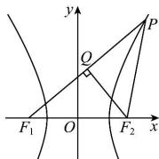

> [!faq]- 全练一本通解析
> **【答案】** B
>
> **【解析】**
> 解析：作 $F_{2}Q\perp PF_{1}$ 于点 Q，如图所示，
> 因为 $\left|F_{1}F_{2}\right|=\left|PF_{2}\right|$ ，所以 Q 为 $PF_{1}$ 的中点，
> 由双曲线的定义知 $\left|\left|PF_{1}\right|-\left|PF_{2}\right|=2a\right.$ 所以 $\left|PF_{1}\right|=2a+2c$ ，故 $\left|F_{1}Q\right|=a+c$ 因为 $\cos\angle PF_{1}F_{2}=\frac{4}{5}$ ，所以 $\frac{\left|F_{1}Q\right|}{\left|F_{1}F_{2}\right|}=\cos\angle PF_{1}F_{2}$ 即 $\frac{a+c}{2c}=\frac{4}{5}$ ，得 3c=5a，所以 $3\sqrt{a^{2}+b^{2}}=5a$ ，得 $\frac{b}{a}=\frac{4}{3}$ ，
> 故双曲线的渐近线方程为 $y=\pm\frac{4}{3}x$ ，即 $4x\pm3y=0$ 。故选：B
> 
