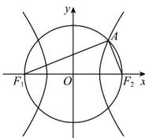

> [!faq]- 全练一本通解析
> **【答案】** B
>
> **【解析】**
> 解析: 因为线段 $F_{1}F_{2}$ 为直径的圆在第一象限交双曲线 C 于点 A，
> 所以 $AF_{1} \perp AF_{2}, \sin \angle AF_{1}F_{2} = \frac{|AF_{2}|}{2c} = \frac{\sqrt{7} - 1}{4}, |AF_{2}| = \frac{(\sqrt{7} - 1)c}{2}$ ,
> 则 $\left|AF_{1}\right|=\frac{\left(\sqrt{7}+1\right)c}{2},\left|AF_{1}\right|-\left|AF_{2}\right|=c=2a.\therefore\frac{b}{a}=\sqrt{\frac{c^{2}-a^{2}}{a^{2}}}=\sqrt{3}$ ∴渐近线方程为 $y=\pm\sqrt{3}x$ . 故选：B.
> 
