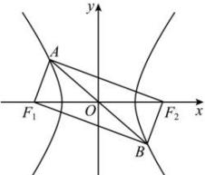

> [!faq]- 全练一本通解析
> **【解析】**
> $y=\pm\frac{\sqrt{6}}{2}x$
> 解析:由 $\overrightarrow{AF_{1}}\cdot\overrightarrow{BF_{1}}=0$ 可得 $\overrightarrow{AF_{1}}\perp\overrightarrow{BF_{1}}$ 由于 A, B 关于原点 O 对称， $F_{1}$ ， $F_{2}$ 关于原点 O 对称，
> 所以四边形 $AF_{1}BF_{2}$ 为矩形，故 $\left|AB\right|=\left|F_{1}F_{2}\right|=2c$ 由于 $\tan\angle ABF_{1}=\frac{\left|AF_{1}\right|}{\left|BF_{1}\right|}=\frac{1}{3}$ ，又 $\left|AF_{2}\right|-\left|AF_{1}\right|=\left|BF_{1}\right|-\left|AF_{1}\right|=2a$ 所以 $\left|BF_{1}\right|=3a,\left|AF_{1}\right|=a$ ，因此 $\left|AB\right|=\sqrt{\left|AF_{1}\right|^{2}+\left|BF_{1}\right|^{2}}=\sqrt{10}a$ 故 $2c = \sqrt{10} a$ ，进而可得 $10a^{2} = 4c^{2} = 4(a^{2} + b^{2}) \Rightarrow \frac{b}{a} = \frac{\sqrt{6}}{2}$ 所以渐近线方程为： $y=\pm\frac{\sqrt{6}}{2}x$ 故答案为： $y=\pm\frac{\sqrt{6}}{2}x$
> 
