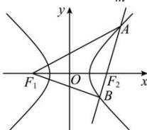

> [!faq]- 全练一本通解析
> **【答案】** B
>
> **【解析】**
> 解析: 双曲线 $x^{2}-\frac{y^{2}}{m^{2}}=1(m>0)$ 的实半轴长 a=1
> 
> 由双曲线的定义, 可得 $\left|AF_{1}\right|-\left|AF_{2}\right|=2a=2,\left|BF_{1}\right|-\left|BF_{2}\right|=2a=2,$
> 所以 $\left|AF_{1}\right|=2+\left|AF_{2}\right|,\left|BF_{1}\right|=2+\left|BF_{2}\right|$
> 则三角形 $ABF_{1}$ 的周长为 $\left|AF_1\right| + \left|BF_1\right| + \left|AB\right| = \left|AF_2\right| + \left|BF_2\right| + 6 = \left|AB\right| + 6 = 8$
>
> 故选 **B**
