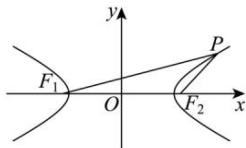

> [!faq]- 全练一本通解析
> **【答案】** $$ 4 \sqrt {2} + 2 \sqrt {5} $$
>
> **【解析】**
> 由题意,
> $$
> E: \frac {x ^ {2}}{4} - y ^ {2} = 1
> $$
> $$
> a = 2, b = 1, c = \sqrt {a ^ {2} + b ^ {2}} = \sqrt {5}
> $$
> $$
> \therefore \left| \left| P F _ {1} \right| - \left| P F _ {2} \right| \right| = 2 a = 4, \left| F _ {1} F _ {2} \right| = 2 c = 2 \sqrt {5}
> $$
> $$
> \cos \frac {\pi}{3} = \frac {\left| P F _ {1} \right| ^ {2} + \left| P F _ {2} \right| ^ {2} - \left| F _ {1} F _ {2} \right| ^ {2}}{2 \left| P F _ {1} \right| \left| P F _ {2} \right|}
> $$
> 所以
> $$
> \left| P F _ {1} \right| \left| P F _ {2} \right| = \left| P F _ {1} \right| ^ {2} + \left| P F _ {2} \right| ^ {2} - \left| F _ {1} F _ {2} \right| ^ {2} = \left(\left| P F _ {1} \right| - \left| P F _ {2} \right|\right) ^ {2}.
> $$
> $$
> \left| P F _ {1} \right| \left| P F _ {2} \right| = 4, \left| P F _ {1} \right| ^ {2} + \left| P F _ {2} \right| ^ {2} = 2 4
> $$
> 所以 $\left(\left|PF_1\right| + \left|PF_2\right|\right)^2 = 32$ ，所以 $\left|PF_1\right| + \left|PF_2\right| = 4\sqrt{2}$
> 所以 $\triangle F_{1}PF_{2}$ 的周长为 $\left|PF_1\right| + \left|PF_2\right| + \left|F_1F_2\right| = 4\sqrt{2} + 2\sqrt{5}$ .
> 故答案为： $4\sqrt{2} + 2\sqrt{5}$
> 
