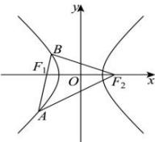

> [!faq]- 全练一本通解析
> **【答案】** B
>
> **【解析】**
> 解析：如图，由于 $\left|AF_1\right| = 2\left|F_1B\right|$ ， $\left|AB\right| = \left|BF_2\right|$ ，且 $\left|BF_2\right| - \left|BF_1\right| = 2a$ ， $\left|AF_2\right| - \left|AF_1\right| = 2a$ ，设 $\left|BF_1\right| = m$ ，则 $\left|AF_1\right| = 2m$ ，故 $\left|BF_2\right| = 3m$ ，所以 $3m - m = 2a$ ，即 $m = a$ ，则 $\left|BF_1\right| = a$ ， $\left|AF_1\right| = 2a$ ， $\left|BF_2\right| = 3a$ ， $\left|AF_2\right| = 4a$ ，在 $\triangle BAF_2$ 中由余弦定理 $\cos \angle F_1BF_2 = \frac{9a^2 + 9a^2 - 16a^2}{2 \times 3a \times 3a} = \frac{1}{9}$ 。故选：B
> 
