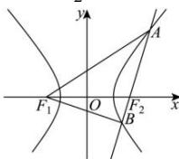

> [!faq]- 全练一本通解析
> **【答案】** $\frac{3}{2}$
>
> **【解析】**
> 依题意过点 $F_{2}$ 的直线与 $\Gamma$ 的右支交于 A, B 两点，
> 且 $\left|AF_{1}\right|=8,\left|BF_{1}\right|=5,\angle AF_{1}B=60^{\circ}$ 则 0 < a < 5， $\left|AF_{2}\right|=8-2a,\left|BF_{2}\right|=5-2a$ 所以 $\left|AB\right|=\left|AF_{2}\right|+\left|BF_{2}\right|=13-4a$ 可得 $(13-4a)^{2}=8^{2}+5^{2}-2\times5\times8\cos60^{\circ}$ 解得 $a=\frac{3}{2}$ 或 a=5 （舍去）. 故答案为： $\frac{3}{2}$ .
> 
