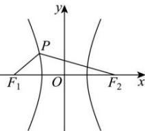

> [!faq]- 全练一本通解析
> **【解析】**
> $\frac{4\sqrt{3}}{3}$
> 
> 解析：
> 由 $x^{2} - \frac{y^{2}}{4} = 1$ 可得： $a = 1, b = 2, c = \sqrt{5}$ ，如图，设 $|PF_{1}| = m, |PF_{2}| = n$ ，则 $n - m = 2$ ①，
> 在 $\triangle PF_{1}F_{2}$ 中，由余弦定理， $20 = m^{2} + n^{2} - 2mn\cos \frac{2\pi}{3}$ ，即： $m^{2} + n^{2} + mn = (m - n)^{2} + 3mn = 20$ ②
> 由①②联立，解得： $mn = \frac{16}{3}$ .
> 则三角形 $F_{1}PF_{2}$ 的面积为 $\frac{1}{2} mn\sin \frac{2\pi}{3} = \frac{\sqrt{3}}{4} \times \frac{16}{3} = \frac{4}{3}\sqrt{3}$ . 故答案为： $\frac{4}{3}\sqrt{3}$ .
