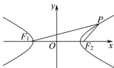

> [!faq]- 全练一本通解析
> **【答案】** $\sqrt{3}$
>
> **【解析】**
> 结合题意可得：双曲线 $\frac{x^2}{4} - y^2 = 1$ 的实半轴长 $a = 2$ ，半焦距 $c = \sqrt{5}$ ，有 $\left\|PF_{1}\right| - \left|PF_{2}\right\| = 2a = 4$ ，
> 在 $\triangle F_{1}PF_{2}$ 中，由余弦定理得 $|F_{1}F_{2}|^{2} = |PF_{1}|^{2} + |PF_{2}|^{2} - 2|PF_{1}||PF_{2}|\cos \angle F_{1}PF_{2}$ ，即有 $|F_{1}F_{2}|^{2} = \left(\left|PF_{1}\right| - \left|PF_{2}\right|\right)^{2} + 2\left|PF_{1}\right|\left|PF_{2}\right|\left(1 - \cos 60^{\circ}\right)$ ，因此 $(2\sqrt{5})^{2} = 4^{2} + 2|PF_{1}||PF_{2}|(1 - \frac{1}{2})$ ，解得 $|PF_{1}|\cdot |PF_{2}| = 4$ ，所以 $\triangle F_{1}PF_{2}$ 的面积为 $S_{\triangle F_1PF_2} = \frac{1}{2}|PF_1|\cdot |PF_2|\sin 60^{\circ} = \sqrt{3}$ . 故答案为： $\sqrt{3}$ .
> 
