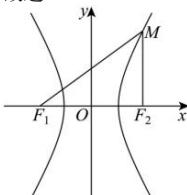

> [!faq]- 全练一本通解析
> **【答案】** C
>
> **【解析】**
> 解析: 由双曲线 $x^{2}-\frac{y^{2}}{3}=1$ ，可得 $a=1,b=\sqrt{3}$ ，则 $c=\sqrt{a^{2}+b^{2}}=2$ ，
> 设 $|MF_{1}|=m,|MF_{2}|=n$ ，由双曲线的定义，可得 $|m-n|=2a=2$ ，
> 根据余弦定理，可得 $\cos\angle F_{1}MF_{2}=\frac{m^{2}+n^{2}-|F_{1}F_{2}|^{2}}{2mn}=\frac{7}{25}$ ，解得 $mn=\frac{25}{3}$ ，再设点 $M$ 的坐标为 $(x_{M},y_{M})$ ，
> 则 $S_{\triangle F_{1}MF_{2}}=\frac{1}{2}mn\sin\angle F_{1}MF_{2}=\frac{1}{2}\times 2c\cdot|y_{M}|$ ,
> 因为 $\cos\angle F_ {1}MF_ {2}=\frac{7}{25}$ ，可得 $\sin\angle F _ { 1 } M F _ { 2 } = \sqrt { 1 - \cos ^ { 2 } \angle F _ { 1 } M F _ { 2 } } = \frac { 24 } { 25 }$ ，解得 $|y _ {M}|= 2$ ，
> 由 $x _ { M } ^ { 2 } - \frac { y _ { M } ^ { 2 } } { 3 } = 1$ ，可得 $|x _ { M }|=\frac { \sqrt { 2 1 } } { 3 }$ ，即点 $M$ 到 $y$ 轴的距离为 $\frac { \sqrt { 2 1 } } { 3 }$ .
> 故选:C.
> 
> 解析:根据双曲线焦点三角形面积公式可知, $S_{\Delta F_{1}PF_{2}}=\frac{b^{2}}{\tan\frac{\angle F_{1}PF_{2}}{2}}=\frac{12}{\tan30^{\circ}}=12\sqrt{3}$
