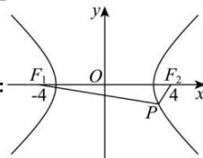

> [!faq]- 全练一本通解析
> **【答案】** AB
>
> **【解析】**
> 
> 如图, 点 $P$ 在双曲线的右支上, 且 $\left|PF_1\right| = 4\left|PF_2\right|$ , 由双曲线的定义可得 $\left|PF_1\right| - \left|PF_2\right| = 2a$ , 解得 $\left|PF_2\right| = \frac{2}{3} a, \left|PF_1\right| = \frac{8}{3} a,$ 由 $\left|PF_2\right| \geq c - a$ , 解得 $c \leq \frac{5}{3} a$ , 即 $1 < e = \frac{c}{a} \leq \frac{5}{3}$ , 故 A、B 两项正确, C、D 错误.
>
> 故选 **AB**.
