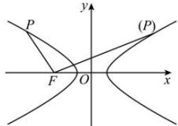

> [!faq]- 全练一本通解析
> **【解析】**
> 详见解析
> 解析: 设 $P(x_{0},y_{0})$ ，则有 $\frac{x_{0}^{2}}{a^{2}}-\frac{y_{0}^{2}}{b^{2}}=1\Rightarrow y_{0}^{2}=b^{2}\left(\frac{x_{0}^{2}}{a^{2}}-1\right)$ ， $F(-c,0)$ ， $\left|PF\right|=\sqrt{y_{0}^{2}+\left(x_{0}+c\right)^{2}}=\sqrt{b^{2}\left(\frac{x_{0}^{2}}{a^{2}}-1\right)+\left(x_{0}+c\right)^{2}}=\sqrt{\left(\frac{c}{a}x_{0}+a\right)^{2}}=\left|\frac{c}{a}x_{0}+a\right|$ 当 P 在双曲线右支时，因为 $x_{0} \geq a$ ，所以 $\frac{c}{a}x_{0} \geq c \Rightarrow \frac{c}{a}x_{0} + a \geq c + a > 0$ 所以 $|PF|$ 的最小值为 $c+a$ 当 P 在双曲线左支时，因为 $x_{0} \leq -a$ ，所以 $\frac{c}{a}x_{0} \leq -c \Rightarrow \frac{c}{a}x_{0} + a \leq -c + a < 0$ 因此 $\left|PF\right|=-a-\frac{c}{a}x_{0},\left|PF\right|$ 的最小值为 c-a，
> 综上所述： $|PF|$ 的最小值为 c-a；
> 
