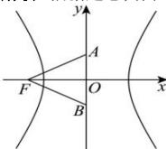

> [!faq]- 全练一本通解析
> **【答案】** A
>
> **【解析】**
> 解析:根据题意,作图如下:
> 
> $\left|\overrightarrow{FA}+\overrightarrow{FB}\right|=2\left|\overrightarrow{FA}-\overrightarrow{FB}\right|$ ，即 $2\left|\overrightarrow{FO}\right|=2\left|\overrightarrow{BA}\right|$ ，也即c=2b，
> 故 $c^{2}=4b^{2}=4\left(c^{2}-a^{2}\right)$ ，解得 $\frac{c^{2}}{a^{2}}=\frac{4}{3}$ ，则 $\frac{c}{a}=\frac{2\sqrt{3}}{3}$ ，也即C的离心率为 $\frac{2\sqrt{3}}{3}$ 。
>
> 故选 **A**。
