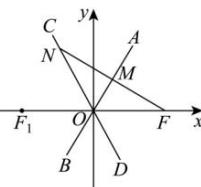

> [!faq]- 全练一本通解析
> **【答案】** B
>
> **【解析】**
> 
> 如图所示, 由题意可知, $\angle AOF = \angle COF_{1}$ , 又因为若 $M$ 是 $FN$ 的中点, $OM \perp FN$ , 所以 $\angle AOF = \angle AOC$ , 所以 $3\angle AOF = \pi$ , $\angle AOF = \frac{\pi}{3}$ , 根据双曲线的性质, 双曲线的渐近线方程为: $y = \pm \frac{b}{a}x$ , $OF = c$ , $\tan \angle AOF = \frac{b}{a}$ , 所以 $\frac{b}{a} = \sqrt{3}$ , 因为 $a^{2} + b^{2} = c^{2}$ , 所以 $e = \frac{c}{a} = \sqrt{1 + \frac{b^{2}}{a^{2}}} = 2$ .
>
> 故选 **B**.
