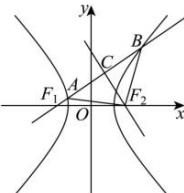

> [!faq]- 全练一本通解析
> **【答案】** C
>
> **【解析】**
> 解析:设双曲线的半焦距为 c, c > 0,
> 
> $$
> \left| B F _ {2} \right| = \left| A F _ {2} \right|
> $$
> $$
> \left| B F _ {1} \right| - \left| B F _ {2} \right| = 2 a
> $$
> $$
> \left| A F _ {2} \right| - \left| A F _ {1} \right| = \left| B F _ {2} \right| - \left| A F _ {1} \right| = 2 a
> $$
> $$
> \left| A B \right| = \left| B F _ {1} \right| - \left| A F _ {1} \right| = 4 a
> $$
> $$
> A C F _ {2}
> $$
> $$
> \left| C F _ {2} \right| = 2 \sqrt {3} a, | A C | = 2 a
> $$
> $$
> \left| A F _ {2} \right| = \sqrt {(2 a) ^ {2} + (2 \sqrt {3} a) ^ {2}} = 4 a
> $$
> $$
> \left| A F _ {1} \right| = 2 a, \left| C F _ {1} \right| = 4 a
> $$
> $$
> \left| C F _ {1} \right| ^ {2} + \left| C F _ {2} \right| ^ {2} = \left| F _ {1} F _ {2} \right| ^ {2}
> $$
> $$
> (4 a) ^ {2} + (2 \sqrt {3} a) ^ {2} = (2 c) ^ {2}
> $$
> $$
> 2 8 a ^ {2} = 4 c ^ {2}
> $$
> $$
> e = \frac {c}{a} = \sqrt {7}
> $$
