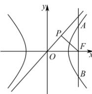

> [!faq]- 全练一本通解析
> **【答案】** D
>
> **【解析】**
> $$
> F (c, 0)
> $$
> $$
> c ^ {2} = 4 + b ^ {2}
> $$
> 过 $F$ 作与 $x$ 轴垂直的直线与双曲线交于 $A, B$ 两点, 不妨设 $A$ 在第一象限,
> 
> 由 $\left\{\frac{x^{2}}{4}-\frac{y^{2}}{b^{2}}=1,\right.$ 解得 $A\left(c,\frac{b^{2}}{2}\right),B\left(c,-\frac{b^{2}}{2}\right)$ ，所以 $\left|AB\right|=b^{2}$ 由双曲线 $\frac{x^2}{4} -\frac{y^2}{b^2} = 1$ 可得渐近线为 $y = \pm \frac{b}{2} x$ 由对称性可知， $F$ 到任一渐近线的距离均相等，不妨求 $F$ 到渐近线 $bx - 2y = 0$ 的距离，
> 所以 $\left|FP\right| = \frac{\left|bc\right|}{\sqrt{b^2 + 4}} = b$ .
> 因为 $\left|AB\right| = \sqrt{5}\left|FP\right|$ ，所以 $b^{2} = \sqrt{5} b$ ，解得 $b = \sqrt{5}$ ：
> 由 $a^2 = 4$ ，则 $a = 2$ ，得 $c = \sqrt{a^2 + b^2} = \sqrt{4 + 5} = 3$ ，所以离心率为 $e = \frac{c}{a} = \frac{3}{2}$
>
> 故选 **D**.
