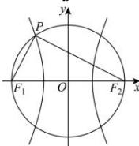

> [!faq]- 全练一本通解析
> **【答案】** C
>
> **【解析】**
> C解析：因为 $a^2 +b^2 = c^2$ ，所以 $x^{2} + y^{2} = c^{2}$ 是以原点为圆心， $c$ 为半径的圆，故 $PF_{1}\perp PF_{2}$ 因为 $\tan \angle PF_1F_2 = 2$ ，所以 $\frac{\left|PF_2\right|}{\left|PF_1\right|} = 2$ ，即 $\left|PF_2\right| = 2\left|PF_1\right|$ 由双曲线定义得 $\left|PF_2\right| - \left|PF_1\right| = 2a$ ，即 $\left|PF_1\right| = 2a,\left|PF_2\right| = 4a$ 由勾股定理得 $\left|PF_2\right|^2 +\left|PF_1\right|^2 = \left|F_1F_2\right|^2$ ，即 $4a^{2} + 16a^{2} = 4c^{2}$ 解得 $e = \frac{c}{a} = \sqrt{5}$
> 
> 双曲线的离心率为 $\sqrt{5}$ .
>
> 故选 **C**
