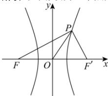

> [!faq]- 全练一本通解析
> **【答案】** B
>
> **【解析】**
> 解析:如图,设另一个焦点为 $F'$ , 分别连接 $PF', PF, OF_{2}$
> 
> 因为 $\left|OP\right|=\left|OF\right|=\left|OF'\right|$ ，所以 $\angle FPF' = 90^{\circ}$ ，
> 则根据焦三角面积公式 $S_{\triangle FPF} = \frac{b^{2}}{\tan \frac{\pi}{4}}$ ，得 $S_{\triangle FPF} = b^{2} = \frac{1}{2} \times 2c \times 2a$ ，即 $b^{2} = 2ca$ ，所以 $c^{2} - a^{2} = 2ca$ ，即 $e^{2} - 1 = 2e$ ，所以 $e = \sqrt{2} + 1$ ，
>
> 故选 **B**.
