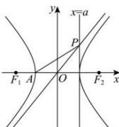

> [!faq]- 全练一本通解析
> **【答案】** $\sqrt{6}$
>
> **【解析】**
> 根据题意,根据双曲线的对称性,不妨令点 $P$ 在渐近线 $y = \frac{b}{a} x$ 上,则 $y_{p} = b$ , 可得 $P(a,b)$ , 由 $A(-a,0)$ , $\left|OP\right| = \sqrt{a^2 + b^2} = c$ , 且 $\left|PA\right| = \sqrt{(a + a)^2 + b^2} = \sqrt{4a^2 + b^2}$ , 因为 $\left|OP\right| = \frac{\sqrt{6}}{3}\left|PA\right|$ , 可得 $\left|OP\right|^2 = \frac{2}{3}\left|PA\right|^2$ , 即 $c^2 = \frac{2}{3}\left(4a^2 + b^2\right)$ , 解得 $c^2 = 6a^2$ , 所以双曲线 $C$ 的离心率 $e = \frac{c}{a} = \sqrt{6}$ . 故答案为: $\sqrt{6}$ .
> 
